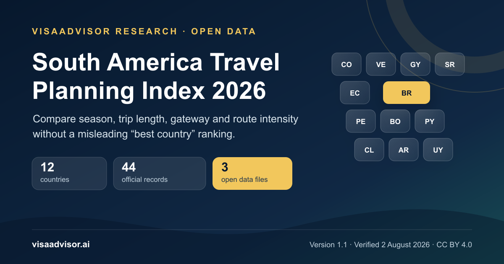

# South America Trip Planning Index 2026

[](https://doi.org/10.5281/zenodo.21765168)
[](https://creativecommons.org/licenses/by/4.0/)



An open, source-linked planning dataset covering all **12 sovereign South
American countries**. Version 1.1 combines regional seasonality, suggested trip
length, gateway notes, route intensity, signature experiences, and official
tourism and entry-check links with a registry of **44 official-source records**.

- **Release:** 1.1
- **Verified:** 2 August 2026
- **Version DOI:** [10.5281/zenodo.21765168](https://doi.org/10.5281/zenodo.21765168)
- **Concept DOI:** [10.5281/zenodo.21765167](https://doi.org/10.5281/zenodo.21765167)
- **Canonical page and methodology:** [VisaAdvisor.ai](https://visaadvisor.ai/south-america-travel-planning-index-2026/)

Use the **version DOI** when citing this exact Version 1.1 release. Use the
**concept DOI** when referring to the dataset as a continuously maintained work
across versions.

## Repository contents

| File | Purpose |
|---|---|
| [`south-america-trip-planning-dataset-2026-v1-1.csv`](south-america-trip-planning-dataset-2026-v1-1.csv) | 12 normalized country records with planning fields and stable source IDs. |
| [`south-america-trip-planning-sources-2026-v1-1.csv`](south-america-trip-planning-sources-2026-v1-1.csv) | 44 source records with provenance, evidence scope, review dates, and sensitivity flags. |
| [`south-america-trip-planning-metadata-2026-v1-1.txt`](south-america-trip-planning-metadata-2026-v1-1.txt) | Field definitions, enums, methodology, release hashes, license scope, and maintenance rules. |
| [`CITATION.cff`](CITATION.cff) | Machine-readable citation metadata for GitHub and reference tools. |
| [`LICENSE.md`](LICENSE.md) | CC BY 4.0 terms and the boundary around linked third-party material. |
| [`CHANGELOG.md`](CHANGELOG.md) | Release history and documentation changes. |
| [`checksums.sha256`](checksums.sha256) | SHA-256 integrity manifest for the release files. |
| [`south-america-index-social-cover-v1-1.png`](south-america-index-social-cover-v1-1.png) | 1200 x 630 release cover. |

## Quick start

The country dataset and source registry join through the source-ID columns.
Multiple IDs in one country field are separated by a vertical bar (`|`). Empty
source-ID fields are intentional and must not be filled by inference.

```python
import pandas as pd

countries = pd.read_csv("south-america-trip-planning-dataset-2026-v1-1.csv")
sources = pd.read_csv("south-america-trip-planning-sources-2026-v1-1.csv")

print(countries[["country", "suggested_days_min", "suggested_days_max"]])
print(sources.groupby("field_type").size())
```

## What the data can and cannot tell you

The dataset is a planning aid, not a safety ranking, a universal best-country
score, or a statement of entry entitlement. Suggested trip lengths, route
intensity, gateway framing, and signature experiences are VisaAdvisor editorial
judgments rather than government recommendations.

Entry rules depend on the traveller's nationality, passport, purpose, and
transit route. Recheck entry requirements and time-sensitive transport
information with the linked authorities before booking. Operational alerts are
historical or time-sensitive evidence and must be checked again against the
relevant airport, airline, authority, or current NOTAM.

## Data integrity

Version 1.1 contains:

- 12 country rows and 12 unique ISO 3166-1 alpha-2 codes;
- 44 unique source IDs matching the `AA-00` pattern;
- 64 country-to-source reference edges;
- no missing, duplicate, or cross-country source references; and
- HTTPS URLs for every record in the source registry.

Verify the mirrored files from the repository root with:

```text
sha256sum -c checksums.sha256
```

## Citation

> Ahmed Abdou, *South America Trip Planning Index 2026: 12-Country Open
> Dataset*, Version 1.1, VisaAdvisor.ai, 2 August 2026.
> https://doi.org/10.5281/zenodo.21765168

Machine-readable citation metadata is available in [`CITATION.cff`](CITATION.cff).

## License

VisaAdvisor.ai's original compilation, structure, and documentation are
released under the [Creative Commons Attribution 4.0 International
License](https://creativecommons.org/licenses/by/4.0/). Linked third-party
material remains subject to each original publisher's terms and is not
relicensed by this repository. See [`LICENSE.md`](LICENSE.md).

## Author and corrections

Edited by **Ahmed Abdou**, travel writer and researcher at VisaAdvisor.ai.

Corrections supported by an official source: [help@visaadvisor.ai](mailto:help@visaadvisor.ai)
